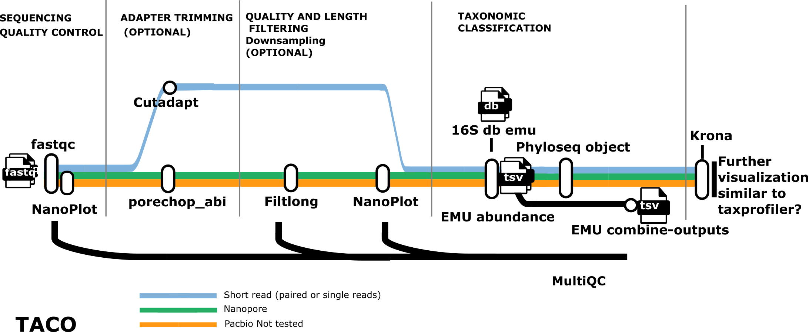

<<<<<<< HEAD
# TACO

[](https://www.nextflow.io/)
[](https://docs.conda.io/en/latest/)
[](https://www.docker.com/)
[](https://sylabs.io/docs/)

## Introduction

<!-- TODO nf-core: Write a 1-2 sentence summary of what data the pipeline is
for and what it does -->

TACO bioinformatics analysis pipeline for the [EMU tool](https://github.com/treangenlab/emu).

This Nextflow pipeline utilizes FastQC, Nanoplot, MultiQC, Porechop_ABI,
Longfilt, EMU, and Krona. EMU is the tool that does the taxonomic profiling of
16S rRNA reads. The results are displayed with Krona. Built with Nextflow, it
ensures portability and reproducibility across different computational
infrastructures. It has been tested on Linux and on mac M1 (not recommended,
quite slow). FastQC and Nanoplot performs quality control, Porechop_ABI trims
adapters (optional), Longfilt filters the fastq-files such that only reads
that are close to 1500 bp are used (optional), EMU assigns taxonomic
classifications, and Krona visualises the result table from EMU. The pipeline
enables microbial community analysis, offering insights into the diversity in
samples.

The pipeline is built using [Nextflow](https://www.nextflow.io), a workflow
tool to run tasks across multiple compute infrastructures in a very portable
manner. It uses Docker/Singularity containers making installation trivial and
results highly reproducible. The [Nextflow DSL2](https://www.nextflow.io/docs/latest/dsl2.html) implementation of this
pipeline uses one container per process which makes it much easier to maintain
and update software dependencies.

## Pipeline summary



The Nanopore and shortread workflow is available.
Minor testing has been done for PacBio and it seems to work.
MultiQC collects only info from FastQC and some information about software versions and
pipeline info.


Krona plot

## Quick Start

1. Install [Nextflow](https://www.nextflow.io/docs/latest/getstarted.html#installation) (`>=22.10.1`)
2. Install any of [Docker](https://docs.docker.com/engine/installation/),
   [Singularity](https://www.sylabs.io/guides/3.0/user-guide/) (you can follow
   [this tutorial](https://singularity-tutorial.github.io/01-installation/)),
   [Podman](https://podman.io/), [Shifter](https://nersc.gitlab.io/development/shifter/how-to-use/)
   or [Charliecloud](https://hpc.github.io/charliecloud/) for full pipeline
   reproducibility (you can use [Conda](https://conda.io/miniconda.html) both
   to install Nextflow itself and also to manage software within pipelines.
   Please only use it within pipelines as a last resort. See
   [docs](https://nf-co.re/usage/configuration#basic-configuration-profiles)).
3. Add you samples to an input file e.g., `sample_sheet.csv`. See examples.
4. Run `make install` which will gunzip all gzipped files in the database
   directory (`assets/databases/emu_database`) and the krona/taxonomy directory
   (`assets/databases/krona/taxonomy`)
5. Run your command:

```bash
nextflow run main.nf \
  --input sample_sheet.csv
  --outdir [absolute path]/taco/results \
  --db /[absolute path]/taco/assets/databases/emu_database \
  --seqtype map-ont \
   -profile singularity,test \
  --quality_filtering \
  --longread_qc_qualityfilter_minlength 1200 \
  --longread_qc_qualityfilter_maxlength 1800
```

## Runs with Nanopore barcode directories

You can run with or without a sample sheet. If no sample_sheet is used, the
results will be named according to the barcode. If a sample sheet is used the
results will be named after whats in the second column of the sample sheet. Note
that the `--input` flag is not needed when `--merge_fastq_pass` is defined.

Run without barcode sample sheet:

```bash
nextflow run main.nf \
  --outdir [absolute path]/taco/results \
  --db /[absolute path]/taco/assets/databases/emu_database \
  --seqtype map-ont \
   -profile singularity,test \
  --quality_filtering \
  --longread_qc_qualityfilter_minlength 1200 \
  --longread_qc_qualityfilter_maxlength 1800 \
  --merge_fastq_pass /[absolute path]/taco/fastq_pass/
```

Run with barcode sample sheet:

```bash
nextflow run main.nf \
  --outdir /[absolute path to]/taco/results \
  --db /[absolute path to database]/taco/assets/databases/emu_database \
  --seqtype map-ont \
   -profile singularity,test \
  --quality_filtering \
  --longread_qc_qualityfilter_minlength 1200 \
  --longread_qc_qualityfilter_maxlength 1800 \
  --merge_fastq_pass /[absolute path to fastq_pass]/fastq_pass/ \
  --barcodes_samplesheet /[absolute path to barcode sample sheet]/sample_sheet_merge.csv
```

## Runs with shortreads

When running TACO with short reads, the primer sequences are trimmed using Cutadapt by default using the provided primer sequences.
The primer sequences can be provided in the sample-sheet or passed as arguments (FW_primer, RV_primer). Primer trimming with Cutadapt can be skipped with --skip_cutadapt.

```bash
sample,fastq_1,fastq_2,FW_primer,RV_primer
SAMPLE,/absolute_path/taco/Sample_R1_001.fastq.gz,/absolute_path/taco/Sample_R2_001.fastq.gz,GTGCCAGCMGCCGCGGTAA,GGACTACNVGGGTWTCTAAT
```

```bash
nextflow run main.nf \
  --input sample_sheet.csv
  --outdir [absolute path]/taco/results \
  --db /[absolute path]/taco/assets/databases/emu_database \
  --seqtype sr \
   -profile singularity
```

```bash
nextflow run main.nf \
  --input sample_sheet.csv
  --outdir [absolute path]/taco/results \
  --db /[absolute path]/taco/assets/databases/emu_database \
  --seqtype sr \
   -profile singularity \
  --FW_primer AGCTGNCCTG\
  --RV_primer TGCATNCTGA
```

## Sample sheets

There are two types of sample sheets that can be used:

1. If the fastq files are already concatenated/merged i.e., the fastq-files in
   Nanopore barcode directories have been concatenated already, the `--input` can
   be used. `--input` expects a `.csv` sample sheet with 3 columns (note the
   header names). It looks like this (See also the `examples` directory):
   ```csv
   sample,fastq_1,fastq_2
   SAMPLE_1,/absolute_path/taco/assets/test_assets/medium_Mock_dil_1_2_BC1.fastq.gz,
   SAMPLE_2,/absolute_path/taco/assets/test_assets/medium_Mock_dil_1_2_BC3.fastq.gz,
   ```
2. If the fastq files are separated in their respective barcode folder i.e., you
   have several fastq files for each sample and they are organized in barcode
   directories in a fastq_pass directory.
   a) If you do not want to create a sample sheet for the barcodes, then the
   results will be named according to the barcode folders. flag
   `--merge_fastq_pass`
   b) If you want your own sample names on the results, then use
   `--merge_fastq_pass` in combination with `--barcodes_samplesheet`. This
   requires a barcode sample sheet which is tab separated. Se example file
   `sample_sheet_merge.csv` in `examples` for a demonstration.

## Useful env variables

```config
NXF_WORK = working directory. # If the work is spread out on different nodes,
                              # set this to a shared place.
                              # export NXF_WORK=/path/to/your/working/dir
APPTAINER_TMPDIR
NXF_SINGULARITY_CACHEDIR
APPTAINER_CACHEDIR
```

## Useful commands for developers

Note that there is a `Makefile` available with a few useful commands to use
when developing:

- `make check` to run most checks that are also run on CI:
  `pre-commit`/`prettier`, `nf-core` lint, and `nf-test test`).
  - **Note:** It is a good idea to run this command before pushing your changes
    to a new pull request!
- `make precommit` to only run pre-commit/prettier.
- `lint` to run the nf-core lint checks.
- `test` to run the nf-test tests.

**Tip:** To see which make commands are available, you can always type `make ` and
then hit `TAB` twice.

## Credits

TACO was originally written by [@fwa93](https://github.com/fwa93).

This pipeline is not a formal nf-core pipeline but it partly uses code and
infrastructure developed and maintained by the [nf-core](https://nf-co.re)
community, reused here under the [MIT license](https://github.com/nf-core/tools/blob/master/LICENSE).

> The nf-core framework for community-curated bioinformatics pipelines.
>
> Philip Ewels, Alexander Peltzer, Sven Fillinger, Harshil Patel, Johannes
> Alneberg, Andreas Wilm, Maxime Ulysse Garcia, Paolo Di Tommaso & Sven
> Nahnsen.
>
> Nat Biotechnol. 2020 Feb 13. doi: 10.1038/s41587-020-0439-x.
> In addition, references of tools and data used in this pipeline are as follows:

### [Nextflow](https://pubmed.ncbi.nlm.nih.gov/28398311/)

> Di Tommaso P, Chatzou M, Floden EW, Barja PP, Palumbo E, Notredame C.
> Nextflow enables reproducible computational workflows. Nat Biotechnol. 2017
> Apr 11;35(4):316-319. doi: 10.1038/nbt.3820. PubMed PMID: 2839>

### Pipeline tools

- [FastQC](https://www.bioinformatics.babraham.ac.uk/projects/fastqc/)

- [MultiQC](https://pubmed.ncbi.nlm.nih.gov/27312411/)
  > Ewels P, Magnusson M, Lundin S, Käller M. MultiQC: summarize analysis
  > results for multiple tools and samples in a single report. Bioinformatics.
  > 2016 Oct 1;32(19):3047-8. doi: 10.1093/bioinformatics/btw354.>

### Software packaging/containerisation tools

- [Anaconda](https://anaconda.com)

  > Anaconda Software Distribution. Computer software. Vers. 2-2.4.0. Anaconda,
  > Nov. 2016. Web.

- [Bioconda](https://pubmed.ncbi.nlm.nih.gov/29967506/)

  > Grüning B, Dale R, Sjödin A, Chapman BA, Rowe J, Tomkins-Tinch CH, Valieris
  > R, Köster J; Bioconda Team. Bioconda: sustainable and comprehensive
  > software distribution for the life sciences. Nat Methods. 2018>

- [BioContainers](https://pubmed.ncbi.nlm.nih.gov/28379341/)

  > da Veiga Leprevost F, Grüning B, Aflitos SA, Röst HL, Uszkoreit J, Barsnes
  > H, Vaudel M, Moreno P, Gatto L, Weber J, Bai M, Jimenez RC, Sachsenberg T,
  > Pfeuffer J, Alvarez RV, Griss J, Nesvizhskii AI, Perez-R>

- [Docker](https://dl.acm.org/doi/10.5555/2600239.2600241)

- [Singularity](https://pubmed.ncbi.nlm.nih.gov/28494014/)

  > Kurtzer GM, Sochat V, Bauer MW. Singularity: Scientific containers for
  > mobility of compute. PLoS One. 2017 May 11;12(5):e0177459. doi:
  > 10.1371/journal.pone.0177459. eCollection 2017. PubMed PMID: 28494014; >

- [EMU](https://github.com/treangenlab/emu)
  > Kristen D. Curry et al., “Emu: Species-Level Microbial Community Profiling
  > of Full-Length 16S RRNA Oxford Nanopore Sequencing Data,” Nature Methods,
  > June 30, 2022, 1–9, https://doi.org/10.1038/s41592-022-015>

## Citations

<!-- TODO nf-core: Add citation for pipeline after first release. Uncomment
lines below and update Zenodo doi and badge at the top of this file. -->

<!-- TODO nf-core: Add bibliography of tools and data used in your pipeline -->

An extensive list of references for the tools used by the pipeline can be found
in the [`CITATIONS.md`](CITATIONS.md) file.
=======
# genomic-medicine-sweden/gms_16s

[](https://github.com/genomic-medicine-sweden/gms_16s/actions/workflows/ci.yml)
[](https://github.com/genomic-medicine-sweden/gms_16s/actions/workflows/linting.yml)[](https://doi.org/10.5281/zenodo.XXXXXXX)
[](https://www.nf-test.com)

[](https://www.nextflow.io/)
[](https://docs.conda.io/en/latest/)
[](https://www.docker.com/)
[](https://sylabs.io/docs/)
[](https://cloud.seqera.io/launch?pipeline=https://github.com/genomic-medicine-sweden/gms_16s)

## Introduction

**genomic-medicine-sweden/gms_16s** is a bioinformatics pipeline that ...

<!-- TODO nf-core:
   Complete this sentence with a 2-3 sentence summary of what types of data the pipeline ingests, a brief overview of the
   major pipeline sections and the types of output it produces. You're giving an overview to someone new
   to nf-core here, in 15-20 seconds. For an example, see https://github.com/nf-core/rnaseq/blob/master/README.md#introduction
-->

<!-- TODO nf-core: Include a figure that guides the user through the major workflow steps. Many nf-core
     workflows use the "tube map" design for that. See https://nf-co.re/docs/contributing/design_guidelines#examples for examples.   -->
<!-- TODO nf-core: Fill in short bullet-pointed list of the default steps in the pipeline -->1. Read QC ([`FastQC`](https://www.bioinformatics.babraham.ac.uk/projects/fastqc/))2. Present QC for raw reads ([`MultiQC`](http://multiqc.info/))

## Usage

> [!NOTE]
> If you are new to Nextflow and nf-core, please refer to [this page](https://nf-co.re/docs/usage/installation) on how to set-up Nextflow. Make sure to [test your setup](https://nf-co.re/docs/usage/introduction#how-to-run-a-pipeline) with `-profile test` before running the workflow on actual data.

<!-- TODO nf-core: Describe the minimum required steps to execute the pipeline, e.g. how to prepare samplesheets.
     Explain what rows and columns represent. For instance (please edit as appropriate):

First, prepare a samplesheet with your input data that looks as follows:

`samplesheet.csv`:

```csv
sample,fastq_1,fastq_2
CONTROL_REP1,AEG588A1_S1_L002_R1_001.fastq.gz,AEG588A1_S1_L002_R2_001.fastq.gz
```

Each row represents a fastq file (single-end) or a pair of fastq files (paired end).

-->

Now, you can run the pipeline using:

<!-- TODO nf-core: update the following command to include all required parameters for a minimal example -->

```bash
nextflow run genomic-medicine-sweden/gms_16s \
   -profile <docker/singularity/.../institute> \
   --input samplesheet.csv \
   --outdir <OUTDIR>
```

> [!WARNING]
> Please provide pipeline parameters via the CLI or Nextflow `-params-file` option. Custom config files including those provided by the `-c` Nextflow option can be used to provide any configuration _**except for parameters**_; see [docs](https://nf-co.re/docs/usage/getting_started/configuration#custom-configuration-files).

## Credits

genomic-medicine-sweden/gms_16s was originally written by Frans Wallin (@fwa93).

We thank the following people for their extensive assistance in the development of this pipeline:

<!-- TODO nf-core: If applicable, make list of people who have also contributed -->

## Contributions and Support

If you would like to contribute to this pipeline, please see the [contributing guidelines](.github/CONTRIBUTING.md).

## Citations

<!-- TODO nf-core: Add citation for pipeline after first release. Uncomment lines below and update Zenodo doi and badge at the top of this file. -->
<!-- If you use genomic-medicine-sweden/gms_16s for your analysis, please cite it using the following doi: [10.5281/zenodo.XXXXXX](https://doi.org/10.5281/zenodo.XXXXXX) -->

<!-- TODO nf-core: Add bibliography of tools and data used in your pipeline -->

An extensive list of references for the tools used by the pipeline can be found in the [`CITATIONS.md`](CITATIONS.md) file.

This pipeline uses code and infrastructure developed and maintained by the [nf-core](https://nf-co.re) community, reused here under the [MIT license](https://github.com/nf-core/tools/blob/main/LICENSE).

> **The nf-core framework for community-curated bioinformatics pipelines.**
>
> Philip Ewels, Alexander Peltzer, Sven Fillinger, Harshil Patel, Johannes Alneberg, Andreas Wilm, Maxime Ulysse Garcia, Paolo Di Tommaso & Sven Nahnsen.
>
> _Nat Biotechnol._ 2020 Feb 13. doi: [10.1038/s41587-020-0439-x](https://dx.doi.org/10.1038/s41587-020-0439-x).
>>>>>>> TEMPLATE
